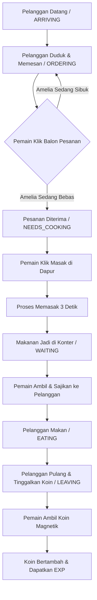

# 🌸 Cici's Brasserie 🥞✨

Selamat datang di **Cici's Brasserie**, sebuah game simulasi manajemen kafe (tycoon/cooking) bergaya pixel art retro yang dibangun menggunakan teknologi web modern. Kelola kafemu, masak makanan lezat, layani pelanggan yang lapar, dan tingkatkan kafe impianmu!

---

## 🎮 Cara Bermain
1. **Pergerakan**: Gunakan tombol **W, A, S, D** di keyboard untuk menggerakkan Amelia (barista kafe).
2. **Menerima Pesanan**: Klik balon pesanan di atas kepala pelanggan yang baru datang (`ORDERING`). Amelia hanya bisa memproses **satu pesanan secara bergantian** untuk menjaga kualitas layanan!
3. **Memasak**: Berjalanlah ke area dapur (kiri atas) dan klik tombol **🍳 MASAK 🍳** yang muncul. Proses memasak membutuhkan waktu beberapa detik.
4. **Mengambil & Menyajikan Makanan**: Berjalanlah mendekati meja konter untuk mengambil makanan yang sudah matang, lalu antarkan ke pelanggan yang memesannya (`WAITING`).
5. **Mengumpulkan Koin**: Pelanggan yang selesai makan (`EATING`) akan pergi dan meninggalkan koin di meja. Berjalanlah mendekati koin tersebut untuk menariknya secara otomatis (**Magnetik**).
6. **Upgrade Kafe**: Klik menu **🛒 SHOP** di navbar atas untuk membuka menu baru seperti *Burger*, *Croissant*, dan *Strawberry Cake* menggunakan koin yang kamu kumpulkan!

---

## 🛠️ Teknologi yang Digunakan
* **Phaser 3**: Framework game HTML5/JavaScript untuk rendering grafis 2D berkinerja tinggi, sistem fisika (*arcade physics*), animasi sprite, dan manajemen state game.
* **JavaScript (ES6+)**: Bahasa pemrograman utama untuk logika permainan, kecerdasan buatan (AI) pelanggan, sistem leveling, dan algoritma *magnetic coin*.
* **HTML5 & Vanilla CSS3**: Untuk struktur kontainer game (`#game-container`) dan styling tampilan agar pas di semua ukuran layar browser.

---

## ✨ Fitur Utama & Kelebihan
* **Desain Visual Pixel Art Premium**: Dilengkapi dengan sistem penskalaan dinamis (*Anti-Gepeng Scaling Logic*), memastikan visual game terlihat proporsional, tajam, dan indah di berbagai perangkat (desktop maupun mobile).
* **Efek Suara Imut & Pengaturan Musik**:
  - Dilengkapi soundtrack musik retro chiptune yang ceria.
  - Memiliki **Menu Pengaturan Suara (Settings)** terintegrasi di halaman utama (Intro) dan menu jeda (Pause) untuk menyalakan/mematikan musik (`ON/OFF`) serta mengatur volume suara secara real-time (`[-]` dan `[+]`).
* **Sistem Koin Magnetik**: Efek visual dinamis di mana koin akan otomatis meluncur terbang ke arah navbar dompet pemain ketika Amelia berada di dekatnya, lengkap dengan efek suara chiptune cringg yang memuaskan.
* **Sistem Level & Toko Upgrade**: Pemain bisa meningkatkan level barista untuk menambah kecepatan jalan, serta membelanjakan koin untuk melakukan *unlock* resep baru di toko upgrade dengan syarat level tertentu.
* **Logika Antrean yang Realistis**: Barista Amelia hanya bisa melayani satu pesanan aktif dalam satu waktu agar siklus gameplay lebih teratur dan menantang bagi pemain.
* **Invisible Physics Boundaries**: Semua dinding pembatas gerakan (*collision boundaries*) disembunyikan sepenuhnya agar estetika permainan terlihat rapi tanpa merusak mekanika tabrakan.

---

## 🧠 Logika & Alur Program (*Game Flow*)


* **Customer State Machine**: Alur hidup pelanggan dikontrol secara ketat melalui state: `ARRIVING` ➔ `ORDERING` ➔ `NEEDS_COOKING` ➔ `WAITING` ➔ `EATING` ➔ `LEAVING`.
* **State Check (Amelia's Busy State)**: Sistem memblokir klik pesanan baru jika Amelia sedang memproses pesanan lain menggunakan logika terpusat:
  ```javascript
  const isBusy = this.isCooking || this.isFoodOnCounter || this.hasFood || 
                 this.customerGroup.getChildren().some(c => c.state === 'NEEDS_COOKING' || c.state === 'WAITING');
  ```

---

## 👥 Pengembang / Author
* **Developer**: Cece & Tim
* **Project**: Tugas Besar / PJBL Game Kafe Impian

---
*Game ini siap dijalankan langsung di browser apa pun tanpa memerlukan instalasi tambahan! Selamat bermain!* 🌸🥞✨
